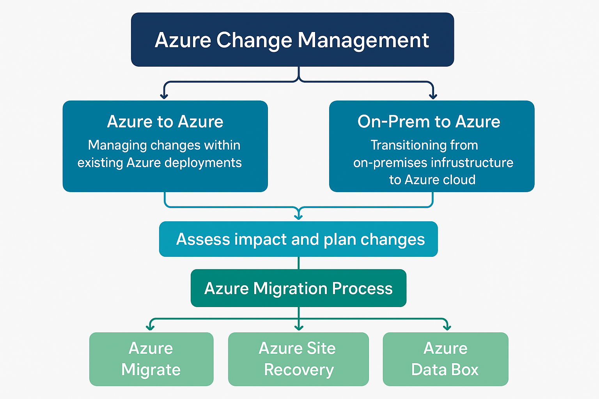

# 📘 Azure Change Management Guidelines

<table style="width:100%; border: none;">
  <tr>
    <td style="vertical-align: top; border: none;">
      🧭 Purpose 
      To define a structured, standardized approach for managing changes to Azure environments, minimizing risk, ensuring traceability, and aligning with operational governance.
    </td>
    <td style="width:220px; text-align: right; border: none;">
      
    </td>
  </tr>
</table>

---
## 🧱 Change Management Scope
Azure Change Management (CM) includes any activity that alters:
- Configuration of Azure services
- Infrastructure deployment (e.g., VM, App Services, AKS)
- Code deployments via pipelines
- Resource scaling, region movement, or SKU changes
- Security or identity configurations (NSGs, RBAC, Key Vault)
- Policy, compliance, and tagging rules

---

## 🔁 CM Process Overview

### 1. **Change Request (CR) Initiation**
- Define: Purpose, impact, affected resources
- Record in DevOps tool or ITSM platform (e.g., ServiceNow, Azure Boards)

### 2. **Impact Assessment**
- Technical review
- Risk classification (Low, Medium, High)
- Stakeholder validation

### 3. **Approval Workflow**
- Change Manager reviews
- Stakeholders sign-off (based on risk tier)

### 4. **Implementation Plan**
- Automation scripts (e.g., Bicep, ARM, Terraform, GitHub Actions)
- Rollback strategy defined
- Maintenance window scheduled (if needed)

### 5. **Execution**
- Performed by engineering team
- Logging and monitoring enabled
- Pre/post validation

### 6. **Review and Closure**
- Change review report
- Update CMDB or documentation
- Lessons learned (if major incident occurred)

---

## 📦 Change Categories & Examples

| Change Type       | Description                                  | Examples                                             |
|-------------------|----------------------------------------------|------------------------------------------------------|
| Standard Change   | Pre-approved, low risk, repeatable           | Autoscaling, patching, cost tag updates              |
| Normal Change     | Requires review and approval                 | Scaling App Plan, updating NSGs                      |
| Emergency Change  | Urgent fix to resolve service disruption     | Reverting to old build, hotfix deployment            |

---

## 🔄 CM Scenarios and Options

### 🟦 Azure to Azure
- **VM SKU change**
- **Resource move (region/resource group)**
- **Network reconfiguration (NSG, VNet)**

### 🟨 On-Premises to Azure (Migration as CM)
- **Lift-and-shift (IaaS migration)**
- **PaaS modernization (App Service, SQL DB)**
- **Data migration (Blob, SQL MI)**

### 🔧 Change Process for Migration

1. **Discovery and Assessment**
   - Azure Migrate, Azure App Service Migration Assistant
2. **Change Request**
   - Capture scope, targets, and post-migration state
3. **Implementation Plan**
   - Tool-based: Azure Migrate, DMS, ASR
4. **Execution**
   - Stage migration, validate in test slot
5. **Cutover and Closure**
   - DNS switch, rollback defined, CMDB updated

---

## 🛠️ Recommended Tools

| Tool                 | Purpose                                    |
|----------------------|--------------------------------------------|
| Azure DevOps         | CI/CD, Boards for change tracking          |
| GitHub Actions       | Automated infrastructure change deployment |
| Azure Migrate        | Workload discovery and migration planning  |
| Azure Policy         | Enforce change compliance and guardrails   |
| Azure Monitor        | Change tracking and insights               |
| Azure Blueprints     | Define, deploy, and update environments    |

---

## ✅ Expected Outcomes
- Reduced risk during infrastructure or application changes
- Increased transparency and traceability of all modifications
- Improved collaboration across DevOps and IT operations
- Alignment with enterprise governance and compliance requirements

---

## 📌 Notes
- All changes should align with business continuity and disaster recovery (BCDR) strategy.
- Automate wherever possible, especially for repeatable changes.
- Maintain a well-documented rollback plan for every change.
- Log all changes and tag changes in Git repos with context (e.g., #CR-2025-004).

---

